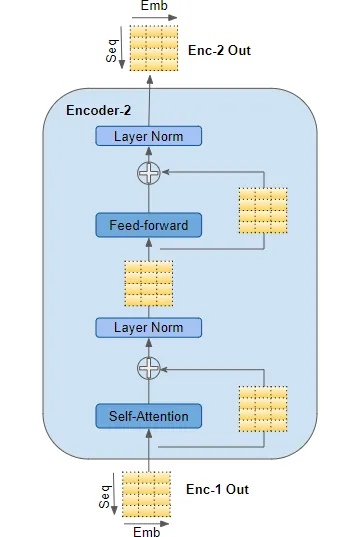

- [\\end{pmatrix}](#endpmatrix)
      - [Output Embedding: " de nada"](#output-embedding--de-nada)
- [\\end{pmatrix}](#endpmatrix-1)
      - [Adding Them Together](#adding-them-together)
    - [Encoder Stack Processing](#encoder-stack-processing)
    - [Prepare and Embed Target Sequence for Decoder](#prepare-and-embed-target-sequence-for-decoder)
    - [Decoder Stack Processing with Encoder Output](#decoder-stack-processing-with-encoder-output)
    - [Output Layer for Word Probabilities](#output-layer-for-word-probabilities)
    - [Loss Function and Back-Propagation](#loss-function-and-back-propagation)
    - [Supplemental Information](#supplemental-information)
      - [Word Embeddings](#word-embeddings)

## Overview

The purpose of this whitepaper is to explain at a medium to low level how LLMs work such that we can make informed decisions about their performance and architectural decisions.

## How Transformers Work

We start by covering how transformers work. Transformers are the core of an LLM model. Below we discover the traditional transformer architecture. GPT-style models do not use the encoders and have what is called a decoder only architecture, but it is difficult to understand that architecture without understanding where it comes from so for this section we cover how the encoder works as well as the decoder.

[This article series](https://towardsdatascience.com/transformers-explained-visually-part-1-overview-of-functionality-95a6dd460452) does a fantastic job of explaining the overarching LLM learning process but there were several parts I didn't immediately understand and moreover it did not provide concrete mathematical examples to illustrate the concepts. I go through and explain the pieces of the article which didn't make sense to me and I have added concrete examples to illustrate the process mathematically.

The below image is an overview model learning and inference process. There are some minor differences between the two processes which I will explain below but at this level they are the same. To illustrate how LLMs work, we will use the example of asking an LLM to translate, "You are welcome" to "De Nada".


[Image Source](https://towardsdatascience.com/transformers-explained-visually-part-1-overview-of-functionality-95a6dd460452)

These are the high level steps which must take place.

1. The input sequence is converted into Embeddings (with Position Encoding) and fed to the Encoder.
2. The stack of Encoders processes this and produces an encoded representation of the input sequence.
3. The target sequence is prepended with a start-of-sentence token, converted into Embeddings (with Position Encoding), and fed to the Decoder.
4. The stack of Decoders processes this along with the Encoder stack’s encoded representation to produce an encoded representation of the target sequence.
5. The Output layer converts it into word probabilities and the final output sequence.
6. The Transformer’s Loss function compares this output sequence with the target sequence from the training data. This loss is used to generate gradients to train the Transformer during back-propagation.

This overview was taken from [here](https://towardsdatascience.com/transformers-explained-visually-part-1-overview-of-functionality-95a6dd460452)

### 1 - Input Sequence to Encoder Embeddings

Let's assume you have a word embedding model that maps each word in the sentence "You are welcome" to a 4-dimensional vector. I use arbitrary numbers for demonstration.

1. **Tokenization**:
    - The sentence "You are welcome" is tokenized into `['You', 'are', 'welcome']`.

2. **[Word Embeddings](#word-embeddings)**:
    - See [Word Embeddings](#word-embeddings) for an explanation of how these work.
    - Assume the embedding model maps 'You' to $[0.1, 0.2, -0.1, 0.4]$.
    - 'are' is mapped to $[-0.3, 0.5, 0.1, -0.2]$.
    - 'welcome' is mapped to $[0.4, -0.3, 0.2, 0.1]$.

3. **Input Matrix \(X\)**:
    - The vectors are stacked to form the input matrix \(X\):
    $$
    X = \begin{pmatrix}
    0.1 & 0.2 & -0.1 & 0.4 \\
    -0.3 & 0.5 & 0.1 & -0.2 \\
    0.4 & -0.3 & 0.2 & 0.1
    \end{pmatrix}
    $$

This \(X\) matrix serves as the input to the neural network, and each row corresponds to the embedding of a word in the sentence "You are welcome". 

Now we need to do the same thing for the output embedding. In many sequence-to-sequence models like Transformers used for tasks like machine translation, a special start token (often denoted as `<s>`, `<start>`, or `[START]`) and sometimes an end token (e.g., `<e>`, `<end>`, or `[END]`) are added to sequences. These tokens provide signals for the beginning and end of sequences and help in the generation process.

1. **Tokenization with Start Token**:
    - The phrase "de nada" becomes `['<start>', 'de', 'nada']`.

2. **Word Embeddings**:
    - Assume our embedding model maps `<start>` to $[0.0, 0.0, 0.0, 0.0]$ (just as a placeholder; in practice, it would have a unique representation).
    - 'de' is mapped to $[-0.2, 0.4, 0.3, 0.1]$.
    - 'nada' is mapped to $[0.5, -0.1, -0.4, 0.3]$.

3. **Output Matrix \(Y\)** with the start token:
    $$
    Y = \begin{pmatrix}
    0.0 & 0.0 & 0.0 & 0.0 \\
    -0.2 & 0.4 & 0.3 & 0.1 \\
    0.5 & -0.1 & -0.4 & 0.3
    \end{pmatrix}
    $$

The inclusion of the start token helps the model recognize the beginning of the output sequence. If there's an end token, it can similarly indicate the end of the sequence, especially useful in generation tasks. What I don't show here is a padding but in the actual models you would likely also have a pad. Ex: `['<start>', 'de', 'nada', '<pad>', '<pad>']` to make sure that the input sequences are the same size. This is a feature of the traditional transformer model but will not appear in the GPT-style models.

### 1.5 Position Encoding

In previous models (Recurrent Neural Networks [RNNs] typically), the position of words in a sentence and their mathematical importance were fixed by virtue of the fact that those models operated on each word sequentially. Transformers on the other hand process all words in a batch at the same time drastically reducing training/inference time. This presents a problem because word order matters. Ex: "The cat sat on the mat." is not the same as "The mat sat on the cat." It is important for us to include the position within the sentence as a value within our framework.

To remedy this, Transformers incorporate a mechanism called Position Encoding. This mechanism is designed to infuse the sequence with positional information, ensuring the model can distinguish between "cat sat on the mat" and "mat sat on the cat".

Just as there was an embedding layer for input and output there are also position encoding layers for both input and output. Importantly, the Position Encoding doesn't rely on the specific words in a sequence. Instead, it assigns a unique encoding to each possible position in the sequence. These encodings are predetermined and consistent across all sequences. These encodings are generated using the following formulas:

$$
PE_{(pos, 2i)} = \sin\left(\frac{pos}{10000^{2i/d_{\text{model}}}}\right)
$$
$$
PE_{(pos, 2i+1)} = \cos\left(\frac{pos}{10000^{2i/d_{\text{model}}}}\right)
$$

- where sin is used for even positions and cos is used for odd positions.
- $pos$: Position of the word in the sequence
- $d_{\text{model}}$: Dimensionality of the embeddings
- $i$: Index for the dimension ranging from 0 to $d_{\text{model}}/2 - 1$

The brilliance of this design lies in its ability to provide rich positional context without being tied to the content of the sequence. This ensures that no matter what words are present, the Transformer always understands their order. To continue our other examples:

Alright, let's compute the position encodings using the given equations for both input and output embeddings.

Given:
- $d_{\text{model}}$ is the dimension of the model, which in our case from the earlier examples is 4.
- The $pos$ variable represents the position of the word in the sequence.
- The $i$ variable ranges from 0 to $d_{\text{model}}/2-1$. Since $d_{\text{model}}$ is 4, $i$ will range from 0 to 1.

#### Input Embedding: "You are welcome"

For the input sequence, we have 3 words, so the positions are $pos = 0, 1, 2$.

Using the given equations:

1. For $pos = 0$:
$$
PE_{(0, 0)} = \sin\left(\frac{0}{10000^{2(0)/4}}\right) = 0\space,\space
PE_{(0, 1)} = \cos\left(\frac{0}{10000^{2(0+1)/4}}\right) = 1\space,\space
PE_{(0, 2)} = \sin\left(\frac{0}{10000^{2(1)/4}}\right) = 0\space,\space
PE_{(0, 3)} = \cos\left(\frac{0}{10000^{2(1+1)/4}}\right) = 1\space,\space
$$

To break that down further:

- $pos = 0$
- $d_{\text{model}} = 4$

1. **For $PE_{(0,0)}$**
    Using the formula for even indices (2i):
    $$i = 0$$
    $$PE_{(0, 2(0))} = \sin\left(\frac{0}{10000^{2(0)/4}}\right)$$
    Since $\sin(0)$ is 0, the value is 0.

2. **For $PE_{(0,1)}$**
    Using the formula for odd indices (2i+1):
    $$i = 0$$
    $$PE_{(0, 2(0)+1)} = \cos\left(\frac{0}{10000^{2(0+1)/4}}\right)$$
    Since $\cos(0)$ is 1, the value is 1.

3. **For $PE_{(0,2)}$**
    Using the formula for even indices (2i):
    $$i = 1$$
    $$PE_{(0, 2(1))} = \sin\left(\frac{0}{10000^{2(1)/4}}\right)$$
    Again, since $\sin(0)$ is 0, the value is 0.

4. **For $PE_{(0,3)}$**
    Using the formula for odd indices (2i+1):
    $$i = 1$$
    $$PE_{(0, 2(1)+1)} = \cos\left(\frac{0}{10000^{2(1+1)/4}}\right)$$
    Once more, since $\cos(0)$ is 1, the value is 1.

Following the same pattern for $pos = 1$ and $pos = 2$, we get:

$$
PE_{\text{input}} = 
\begin{pmatrix}
0 & 1 & 0 & 1 \\
\sin\left(\frac{1}{10000^0}\right) & \cos\left(\frac{1}{10000^{0.5}}\right) & \sin\left(\frac{1}{10000^2}\right) & \cos\left(\frac{1}{10000^{2.5}}\right) \\
\sin\left(\frac{2}{10000^0}\right) & \cos\left(\frac{2}{10000^{0.5}}\right) & \sin\left(\frac{2}{10000^2}\right) & \cos\left(\frac{2}{10000^{2.5}}\right)
\end{pmatrix}
=
\begin{pmatrix}
0 & 1 & 0 & 1 \\
0.8415 & 0.99995 & 0.0001 & 1 \\
0.9093 & 0.9998 & 0.0002 & 1
\end{pmatrix}
$$


#### Output Embedding: "<start> de nada"

For the output sequence, we also have 3 words/tokens. The positions again are $pos = 0, 1, 2$.

Using the equations similarly:

$$
PE_{\text{output}} = 
\begin{pmatrix}
0 & 1 & 0 & 1 \\
\sin\left(\frac{1}{10000^0}\right) & \cos\left(\frac{1}{10000^{0.5}}\right) & \sin\left(\frac{1}{10000^2}\right) & \cos\left(\frac{1}{10000^{2.5}}\right) \\
\sin\left(\frac{2}{10000^0}\right) & \cos\left(\frac{2}{10000^{0.5}}\right) & \sin\left(\frac{2}{10000^2}\right) & \cos\left(\frac{2}{10000^{2.5}}\right)
\end{pmatrix}
=
\begin{pmatrix}
0 & 1 & 0 & 1 \\
0.8415 & 0.99995 & 0.0001 & 1 \\
0.9093 & 0.9998 & 0.0002 & 1
\end{pmatrix}
$$

Finally, to incorporate these position encodings into our embeddings, you would simply add the corresponding position encoding to each row of the embedding matrices $X$ and $Y$.

#### Adding Them Together

Given:

$$
X = \begin{pmatrix}
0.1 & 0.2 & -0.1 & 0.4 \\
-0.3 & 0.5 & 0.1 & -0.2 \\
0.4 & -0.3 & 0.2 & 0.1
\end{pmatrix}
$$

$$
Y = \begin{pmatrix}
0.0 & 0.0 & 0.0 & 0.0 \\
-0.2 & 0.4 & 0.3 & 0.1 \\
0.5 & -0.1 & -0.4 & 0.3
\end{pmatrix}
$$

The position encodings (from our previous calculations) are:

$$
PE_{\text{input/output}} = \begin{pmatrix}
0 & 1 & 0 & 1 \\
0.8415 & 0.99995 & 0.0001 & 1 \\
0.9093 & 0.9998 & 0.0002 & 1
\end{pmatrix}
$$

Adding position encodings to $X$:

$$
X + PE_{\text{input}} = \begin{pmatrix}
0.1 + 0 & 0.2 + 1 & -0.1 + 0 & 0.4 + 1 \\
-0.3 + 0.8415 & 0.5 + 0.99995 & 0.1 + 0.0001 & -0.2 + 1 \\
0.4 + 0.9093 & -0.3 + 0.9998 & 0.2 + 0.0002 & 0.1 + 1
\end{pmatrix}
= \begin{pmatrix}
0.1 & 1.2 & -0.1 & 1.4 \\
0.5415 & 1.49995 & 0.1001 & 0.8 \\
1.3093 & 0.6998 & 0.2002 & 1.1
\end{pmatrix}
$$

Adding position encodings to $Y$:

$$
Y + PE_{\text{output}} = \begin{pmatrix}
0.0 + 0 & 0.0 + 1 & 0.0 + 0 & 0.0 + 1 \\
-0.2 + 0.8415 & 0.4 + 0.99995 & 0.3 + 0.0001 & 0.1 + 1 \\
0.5 + 0.9093 & -0.1 + 0.9998 & -0.4 + 0.0002 & 0.3 + 1
\end{pmatrix}
= \begin{pmatrix}
0.0 & 1.0 & 0.0 & 1.0 \\
0.6415 & 1.39995 & 0.3001 & 1.1 \\
1.4093 & 0.8998 & -0.3998 & 1.3
\end{pmatrix}
$$

These new matrices incorporate both the embeddings and the position information, and they will be used as input to subsequent layers of the Transformer model. One more thing you should take from this is that the contents of the input are independent of the position embedding. The only thing that matters is the position of the word for the position embedding. What we now have is a matrix that contains information on both the relationships of the word and its position in the sentence.

This is visualized well in [this post](https://towardsdatascience.com/transformers-explained-visually-part-2-how-it-works-step-by-step-b49fa4a64f34)


It's worth noting in our example we are only showing a single line of text but in reality you would batch multiple sets of text together in the traditional transformer model. The shape of the matrix will remain unchanged until we reach the final output layer. The other bit of complexity you see in the figure above that we don't here is that realistically the word vector matrix describing the word's relationships would be multidimensional but here we used a basic, two dimensional, matrix.

Now we are ready to move onto encoding.

### Encoder Stack Processing

The encoding process looks like this at a high level as illustrated [here](https://towardsdatascience.com/transformers-explained-visually-part-2-how-it-works-step-by-step-b49fa4a64f34):



At a high level this is what each component does:

- **Self-Attention**: This mechanism allows the model to weigh the importance of different words in the sequence relative to each other. It outputs a matrix of the same size which is a combination of input vectors based on their attention scores.
- **Layer Norm**: After the self-attention mechanism, the output undergoes a layer normalization to stabilize the activations and assist with training.
- **Feed-forward**: The normalized output is passed through a feed-forward neural network. This is present in each transformer block and helps in further transformation of the data.
  - One of the things that wasn't immediately obvious to me was why this exists. It does a couple of things. First, this is where most of the "learning" happens. It is in the feedforward network that the complex relationships between different tokens (words) and general ideas are really stored. Each word is independently transformed by some linear transformation (IE: a matrix operation of some variety be it addition, subtraction, multiplication, division). Secondly, it introduces non-linearity. If you aren't heavy into math it may not be immediately obvious why you care about this. If you have a linear model its performance ends up being roughly the same as some sort of linear regression. That's fine for basic statistical analysis but that's what we have been doing for decades and is hardly going to do anything earth shattering for you. By making the model non-linear it allows it to create a function which more closely approximates complex relationships. Said in a non-mathy way, it is the juice that gets you the cider that is something as fantastic as ChatGPT. Third, it provides depth. What is depth is the question I first had immediately following this explanation. Imagine your model is evaluating pictures. The lowest level might learn rough outlines, maybe some colors or textures, but that's it. Maybe the picture is of a face and at the moderate levels of depth it starts to learn what an eye or a nose look like. Finally, at the deepest levels the model figures out who the picture is of or identifies whether the person is happy or sad.
- **Layer Norm**: Post feed-forward operation, another layer normalization is performed.

#### Self Attention

The purpose of the self attention portion of the algorithm is explained fantastically in [this paper by Troy Wang](https://www.cis.upenn.edu/wp-content/uploads/2021/10/Tianzheng_Troy_Wang_CIS498EAS499_Submission.pdf#page=11).

> Self-attention is one of the key differentiating characteristics of the transformer model. It is a
> critical component that enables the Transformer to comprehend language contexts intelligently
> [VSP+17].
> The objective of attention can be clearly illustrated by a simple example. Given an input such as
> “Professor Marcus gave some really good advice to Troy, one of his students, because he has
> extensive experiences in the academia.” For a human reader, it is clear that the word “he” in the
> second half of the sentence refers to “Professor Marcus,” instead of his student. But for a computer
> program, it’s not so apparent. There are many such circumstances where grammatical ambiguities
> legally exist, such that rule-based and hard-coded logic would not be sufficient for effective
> language analysis and comprehension [VSP+17][Alammar18].
> This is where self-attention comes into play. When the model processes each token input, self-
> attention enables the model to associate the meaning of the current token with other tokens, such
> as associating “he” with “Professor Marcus” in our previous example, in order to gain better
> knowledge of this current input. In other words, the transformer model learns how to pay attention
> to the context thanks to the self-attention mechanism. It turns out that natural language has a lot of
> sequential dependencies, and thus the ability to incorporate information from previous words in
> the input sequence is critical to comprehending the input [VSP+17][Alammar18].

The actual math of this is a bit confusing so I found it was best to read it first from [our friend Troy Wang](https://www.cis.upenn.edu/wp-content/uploads/2021/10/Tianzheng_Troy_Wang_CIS498EAS499_Submission.pdf#page=11) and then I'll provide a more detailed explanation where I really break down what he is saying.

> Now, let's breakdown the process of computing self-attention. Before computing self-attention, each individual input token is first being converted into a vector using the embedding algorithm that we discussed earlier. Then, for each embedding, we calculate its query vector ($\mathbf{Q}$), key vector ($\mathbf{K}$), and value vector ($\mathbf{V}$) by multiplying the embedding vector with three pre-trained matrices $\mathbf{W_Q}$, $\mathbf{W_K}$, $\mathbf{W_V}$ intended for calculating the three matrices respectively. Notice that the three vectors all have the same dimension, and it does not have to be equal with the dimension of the embedding vectors. The dimensions of the three matrices are the same, and they are all length of the embedding vectors by the length of the ($\mathbf{Q}$), ($\mathbf{K}$), and ($\mathbf{V}$) vectors. Then, for each input embedding, we dot multiply its own $\mathbf{Q}$ vector with every other input embedding's $\mathbf{K}$ vector. At this point, for every input embedding, we have calculated a set of score corresponding to each and every embedding in the input sequence, including itself. Then for each of the embedding, we divide all its scores by the square root of the dimension of the key vectors for more stable gradients and pass the scores through the softmax function for normalization. After this, we multiply each $\mathbf{V}$ vector in the input sequence with its respective softmax score, and finally add up those weighted value vectors. This resulting sum vector is the self-attention of this particular input embedding \[VSP+17\] \[Alammar18\]\[IYA16\].
>
> Although we described the process in terms of vectors, in practice it is implemented by means of matrices. This is because the computation process for each vector independent and identical. We would stack our input embeddings as rows in an input matrix, multiply this matrix with learned weight matrices $W_Q$, $W_K$, $W_V$ and get $(Q)$, $(K)$, and $(V)$ vectors respectively, feed the three resulting matrices into the softmax function as:
>
> $$\text{Attention}(Q, K, V) = \text{softmax}\left(\frac{Q \times K^T}{\sqrt{d_k}}\right) \times V$$

Ok, let's start with explaining what exactly are Q, K, and V because that wasn't immediately obvious to me when I read Wang's paper.

Of course! Let's dive deeper into the roles of the Query (Q), Key (K), and Value (V) matrices in the self-attention mechanism:

1. **Query (Q)**:
      - **Purpose**: The Query matrix is used to represent the current word or token we are focusing on. Think of it as asking a question: "Which words in the sequence are most relevant to this one?" 
      - **Function**: In the self-attention mechanism, the Q vector of a token is used to score how much other tokens should be attended to. By taking the dot product of Q with every K (explained below), we obtain a score that determines how much focus each token in the sequence should have in relation to the current token.
2. **Key (K)**:
      - **Purpose**: The Key matrix represents all the tokens that we will check our current token against to determine their level of similarity or relevance.
      - **Function**: The K vectors are matched against the Q vector to produce attention scores. The intuition is that if a Q vector has a high dot product with a K vector, then the corresponding tokens are relevant to each other. This score indicates the weight or level of attention the model should give to the token represented by that particular K when considering the token represented by Q.
3. **Value (V)**:
      - **Purpose**: The Value matrix represents the actual content of the tokens. While Q and K are used to determine the relationships and relevance among tokens, V provides the content we want to extract based on those relationships.
      - **Function**: Once we have our attention scores (from the Q-K dot products), these scores determine how much of each V vector we take into the final output. If a token is deemed highly relevant, its V vector contributes more to the final representation of the current token.

**An Analogy**:

Imagine you're in a spy in a room with multiple people having conversations. You're eavesdropping on one person (the "query"), but you also want to gather context from what everyone else (the "keys") are saying to understand as much as you can.

- The **Q** (Query) is you asking: "Who in this room is relevant to what the target (query) is saying?"
- The **K** (Keys) are the topics each person in the room is talking about. By comparing your query to each topic (taking the dot product of Q and K), you determine who is talking about things most relevant to the person you're focusing on.
- The **V** (Values) are the actual words or content of what each person is saying. Once you've identified the most relevant people based on your query and keys, you take a weighted sum of their words (the V vectors) to get the complete context.

The self-attention mechanism uses this approach to weigh the importance of different tokens in a sequence relative to a particular token, resulting in a rich contextual representation for each token in the input.

Ok, now that we better understand Q, K, and V let's look at the total process from beginning to end and go through an example.

$$\text{Attention}(Q, K, V) = \text{softmax}\left(\frac{Q \times K^T}{\sqrt{d_k}}\right) \times V$$

1. **Calculating Q, K, and V**:
    - **What happens**: Each embedding vector gets transformed into three different vectors: Query (Q), Key (K), and Value (V).
    - **How it happens**: Multiply the embedding vector with three distinct pre-trained matrices ($W_Q$, $W_K$, and $W_V$).
    - **Why it matters**: These vectors serve distinct purposes. Q is used to fetch the attention score, K provides a set of keys to match against, and V serves as a pool of values to fetch from based on those scores.
    - **Relationship to equation**: This step produces the Q, K, and V vectors which are central elements in the equation.

2. **Dot Product between Q and K**:
    - **What happens**: Each Q vector is dot-multiplied with every K vector.
    - **How it happens**: This is simple vector multiplication between Q of a particular token and the K of every other token, resulting in a score.
    - **Why it matters**: This score represents how much attention should be paid to other tokens when encoding information about a particular token.
    - **Relationship to equation**: This step corresponds to the $Q \times K^T$ part of the equation.

3. **Scaling the Scores**:
    - **What happens**: The scores from the previous step are scaled down.
    - **How it happens**: Each score is divided by the square root of the dimension of the K vectors.
    - **Why it matters**: This step ensures stable gradients. Without this scaling, the gradients could be too small for effective learning, especially when the dimensionality (or depth) of the keys is large.
    - **Relationship to equation**: This step is represented by the division by $\sqrt{d_k}$ in the equation.

4. **Applying Softmax**:
    - **What happens**: The scores for each token are turned into a probability distribution using the softmax function.
    - **How it happens**: Softmax normalizes the scores so they're between 0 and 1 and sum up to 1.
    - **Why it matters**: This provides a clear set of attention "weights" for each token. The higher the softmax output, the more attention the model pays to the corresponding token.
      - I wasn't immediately clear on why softmax. TODO
    - **Relationship to equation**: This step is captured by the $\text{softmax}(\cdot)$ operation in the equation.

5. **Calculating Weighted Values**:
    - **What happens**: The V vectors are multiplied by the softmax scores.
    - **How it happens**: Each token's V vector is weighted by the token's respective softmax score from the previous step.
    - **Why it matters**: This step essentially picks out values from the V vectors proportional to the attention scores. Tokens deemed more relevant contribute more to the final output.
    - **Relationship to equation**: This step corresponds to the $\times V$ at the end of the equation, where the weighted values from the softmax operation are combined with V.

6. **Summing Weighted Values**:
    - **What happens**: The weighted V vectors are summed up.
    - **How it happens**: A simple vector summation.
    - **Why it matters**: The resulting vector is the final output for a particular token, which is a combination of features from other tokens based on the attention scores.
    - **Relationship to equation**: This summation is implied in the matrix multiplication in the equation. The result of the $\text{softmax}(\cdot) \times V$ operation is the summed attention output for each token.

7. **Matrix Computations in Practice**:
    - **What happens**: The operations described above, while explained using vectors, are in practice executed using matrices.
    - **How it happens**: Instead of processing tokens one-by-one, all tokens are processed simultaneously by stacking embeddings into a matrix and using matrix multiplication for efficiency.
    - **Why it matters**: Matrix operations are highly optimized and parallelizable, making the computations significantly faster, especially on hardware like GPUs.
    - **Relationship to equation**: The use of Q, K, and V in the equation reflects these matrix computations.

8. **The Attention Output**:
    - The equation one last time:
    $$
    \text{Attention}(Q, K, V) = \text{softmax}\left(\frac{Q \times K^T}{\sqrt{d_k}}\right) \times V
    $$
    - This formula captures the essence of the self-attention mechanism. The product of Q and $K^T$ gives attention scores, which after scaling and softmax, are used to weigh the V values.

##### A Concrete Example

Given the above steps for calculating self-attention, let's break it down:
1. **Create Query (Q), Key (K), and Value (V) Matrices**: We obtain these by multiplying the input embeddings (with position encodings) with the weight matrices $W_Q$, $W_K$, and $W_V$ respectively. 
  For the sake of this example, we will assume these weight matrices are:
  $$
  W_Q = \begin{pmatrix} 1 & 0 & 0 & 1 \\ 0 & 1 & 1 & 0 \\ 0 & 1 & 0 & 1 \\ 1 & 0 & 1 & 0 \end{pmatrix}
  $$
  $$
  W_K = \begin{pmatrix} 0 & 1 & 1 & 0 \\ 1 & 0 & 0 & 1 \\ 1 & 0 & 1 & 0 \\ 0 & 1 & 0 & 1 \end{pmatrix}
  $$
  $$
  W_V = \begin{pmatrix} 1 & 1 & 0 & 0 \\ 0 & 0 & 1 & 1 \\ 0 & 1 & 1 & 0 \\ 1 & 0 & 0 & 1 \end{pmatrix}
  $$
2. **Compute Q, K, and V**: Multiply the input matrix $X$ with these weights:
  $$
  Q = X \times W_Q
  $$
  $$
  K = X \times W_K
  $$
  $$
  V = X \times W_V
  $$
3. **Calculate Attention Scores**: This is done by multiplying $Q$ with $K^T$, then dividing by the square root of the dimension of the key vectors $d_k$. In our example, $d_k$ is 4.
  $$
  Score = \frac{Q \times K^T}{\sqrt{d_k}}
  $$
4. **Apply Softmax to the Scores**: This will give each word's attention score.
  $$
  SoftmaxScore = \text{softmax}(Score)
  $$
5. **Multiply Softmax Score with V**: This will give the weighted representation of the input with respect to other words in the sentence.
  $$
  AttentionOutput = SoftmaxScore \times V
  $$

Let's calculate the matrices Q, K, V, Score, SoftmaxScore, and AttentionOutput:

To begin, we will compute the $Q$, $K$, and $V$ matrices.

Using:
$$
X + PE_{\text{input}} = 
\begin{pmatrix}
0.1 & 1.2 & -0.1 & 1.4 \\
-0.3 + \sin\left(\frac{1}{10000^0}\right) & 0.5 + \cos\left(\frac{1}{10000^{0.5}}\right) & 0.1 + \sin\left(\frac{1}{10000^2}\right) & -0.2 + \cos\left(\frac{1}{10000^{2.5}}\right) \\
0.4 + \sin\left(\frac{2}{10000^0}\right) & -0.3 + \cos\left(\frac{2}{10000^{0.5}}\right) & 0.2 + \sin\left(\frac{2}{10000^2}\right) & 0.1 + \cos\left(\frac{2}{10000^{2.5}}\right)
\end{pmatrix}
$$

Given the weight matrices:
$$
W_Q = \begin{pmatrix} 1 & 0 & 0 & 1 \\ 0 & 1 & 1 & 0 \\ 0 & 1 & 0 & 1 \\ 1 & 0 & 1 & 0 \end{pmatrix}
$$
$$
W_K = \begin{pmatrix} 0 & 1 & 1 & 0 \\ 1 & 0 & 0 & 1 \\ 1 & 0 & 1 & 0 \\ 0 & 1 & 0 & 1 \end{pmatrix}
$$
$$
W_V = \begin{pmatrix} 1 & 1 & 0 & 0 \\ 0 & 0 & 1 & 1 \\ 0 & 1 & 1 & 0 \\ 1 & 0 & 0 & 1 \end{pmatrix}
$$

1. Compute $Q$:
  $$
  Q = (X + PE_{\text{input}}) \times W_Q
  $$

2. Compute $K$:
  $$
  K = (X + PE_{\text{input}}) \times W_K
  $$

3. Compute $V$:
  $$
  V = (X + PE_{\text{input}}) \times W_V
  $$

Let's calculate these values:

First, let's compute the `Q` matrix using our input matrix \( X + PE_{\text{input}} \) and the \( W_Q \) matrix:

$$
Q = (X + PE_{\text{input}}) \times W_Q
$$

Given:

$$
X + PE_{\text{input}} = 
\begin{pmatrix}
0.1 & 1.2 & -0.1 & 1.4 \\
-0.3 + \sin\left(\frac{1}{10000^0}\right) & 0.5 + \cos\left(\frac{1}{10000^{0.5}}\right) & 0.1 + \sin\left(\frac{1}{10000^2}\right) & -0.2 + \cos\left(\frac{1}{10000^{2.5}}\right) \\
0.4 + \sin\left(\frac{2}{10000^0}\right) & -0.3 + \cos\left(\frac{2}{10000^{0.5}}\right) & 0.2 + \sin\left(\frac{2}{10000^2}\right) & 0.1 + \cos\left(\frac{2}{10000^{2.5}}\right)
\end{pmatrix}
$$

$$
W_Q = 
\begin{pmatrix} 
1 & 0 & 0 & 1 \\ 
0 & 1 & 1 & 0 \\ 
0 & 1 & 0 & 1 \\ 
1 & 0 & 1 & 0 
\end{pmatrix} 
$$

When you multiply the above matrices, you get:

$$
Q=\begin{pmatrix}
1.5 & 1.1 & 2.6 & 0 \\
1.3415 & 1.6 & 2.3 & 0.6415 \\
2.4093 & 0.8998 & 1.7998 & 1.5093
\end{pmatrix}
$$


If your matrix multiplication is rusty see [the matrix math behind this calculation](#matrix-multiplication).

We compute the $K$ matrix using our input matrix $X + PE_{\text{input}}$ and the $W_K$ matrix:

$$
K = (X + PE_{\text{input}}) \times W_K
$$

Given:

$$
X + PE_{\text{input}} = 
\begin{pmatrix}
0.1 & 1.2 & -0.1 & 1.4 \\
-0.3 + \sin(\frac{1}{10000^0}) & 0.5 + \cos(\frac{1}{10000^0.5}) & 0.1 + \sin(\frac{1}{10000^2}) & -0.2 + \cos(\frac{1}{10000^2.5}) \\
0.4 + \sin(\frac{2}{10000^0}) & -0.3 + \cos(\frac{2}{10000^0.5}) & 0.2 + \sin(\frac{2}{10000^2}) & 0.1 + \cos(\frac{2}{10000^2.5})
\end{pmatrix}
$$

$$
W_K = 
\begin{pmatrix} 
0 & 1 & 1 & 0 \\ 
1 & 0 & 0 & 1 \\ 
1 & 0 & 1 & 0 \\ 
0 & 1 & 0 & 1 
\end{pmatrix} 
$$

When you multiply the above matrices, you get:

$$
K=\begin{pmatrix}
1.1 & 1.5 & 0 & 2.6 \\
1.6001 & 1.3415 & 0.6416 & 2.3 \\
0.9 & 2.4093 & 1.5095 & 1.7998
\end{pmatrix}
$$

Finally we do the math for $V$. $X + PE_{\text{input}}$ and the $W_V$ matrix:

$$
V = (X + PE_{\text{input}}) \times W_V
$$

Given:

$$
X + PE_{\text{input}} = 
\begin{pmatrix}
0.1 & 1.2 & -0.1 & 1.4 \\
-0.3 + \sin\left(\frac{1}{10000^0}\right) & 0.5 + \cos\left(\frac{1}{10000^{0.5}}\right) & 0.1 + \sin\left(\frac{1}{10000^2}\right) & -0.2 + \cos\left(\frac{1}{10000^{2.5}}\right) \\
0.4 + \sin\left(\frac{2}{10000^0}\right) & -0.3 + \cos\left(\frac{2}{10000^{0.5}}\right) & 0.2 + \sin\left(\frac{2}{10000^2}\right) & 0.1 + \cos\left(\frac{2}{10000^{2.5}}\right)
\end{pmatrix}
$$

$$
W_V = 
\begin{pmatrix} 
0 & 0 & 1 & 1 \\ 
1 & 1 & 0 & 0 \\ 
0 & 1 & 0 & 1 \\ 
1 & 0 & 1 & 0 
\end{pmatrix} 
$$

Multiplying the matrices, we get:

$$
V=\begin{pmatrix}
1.5 & 0 & 1.1 & 2.6 \\
1.3415 & 0.6416 & 1.6001 & 2.3 \\
2.4093 & 1.5095 & 0.9 & 1.7998
\end{pmatrix}
$$

We perform the [same calculations](#calculating-y) for $Y$. Here are the results:

$$
\text{Q}=
\begin{pmatrix}
1 & 1 & 2 & 0 \\
1.7415 & 1.7001 & 2.5 & 0.9416 \\
2.7093 & 0.5 & 2.1998 & 1.0095
\end{pmatrix}
$$

$$
\text{K}=
\begin{pmatrix}
1 & 1 & 0 & 2 \\
1.7001 & 1.7415 & 0.9416 & 2.5 \\
0.5 & 2.7093 & 1.0095 & 2.1998
\end{pmatrix}
$$

$$
\text{V}=
\begin{pmatrix}
1 & 0 & 1 & 2 \\
1.7415 & 0.9416 & 1.7001 & 2.5 \\
2.7093 & 1.0095 & 0.5 & 2.1998
\end{pmatrix}
$$

This gives us the $V$ matrix. With $Q$, $K$, and $V$ matrices in hand, you're ready to compute the attention scores and proceed with the self-attention mechanism.


### Prepare and Embed Target Sequence for Decoder
### Decoder Stack Processing with Encoder Output
### Output Layer for Word Probabilities
### Loss Function and Back-Propagation

### Supplemental Information

#### Word Embeddings

The first question(s) I asked when I saw these matrices is, "Where do these values come from and what are they?" What followed soon after was, "Why do they exist?" Why they exist lends context to where do they come from and what are they.

*Why do they exist*

The article [Large language models, explained with a minimum of math and jargon](https://www.understandingai.org/p/large-language-models-explained-with) does a fantastic job of answering this in a non-mathematical way. The goal here is that we want to describe mathematically the relationship between some given word and other words because this will then allow us to more accurately predict what words should go in the answers our LLM produces. Words that are similar should have similar vector values. This concept was pioneered at Google in [a paper called Word2vec](https://en.wikipedia.org/wiki/Word2vec). You can see this visually at [this website](http://vectors.nlpl.eu/explore/embeddings/en/MOD_enwiki_upos_skipgram_300_2_2021/airplane_NOUN/). For example, I wanted to see what airplanes are likely to be related to airplanes:


The percentage similarity to "airplane":

- **aeroplane**: NOUN, 0.8153
- **aircraft**: NOUN, 0.7992
- **plane**: NOUN, 0.7429
- **airliner**: NOUN, 0.7398
- **helicopter**: NOUN, 0.7006
- **aircraave**: NOUN, 0.6568
- **biplane**: NOUN, 0.6540
- **airship**: NOUN, 0.6404
- **dc-3**: NOUN, 0.6297
- **seaplane**: NOUN, 0.6271


*Where do these values come from?*

The answer is it depends. There are three potential places these values may originate from at first:

1. Random Initialization: Here, the embeddings are initialized with small random values. These values then get adjusted during training to capture semantic meanings.
2. Pre-trained Embeddings: Instead of starting with random values, it's common to initialize the embeddings with vectors from pre-trained models like Word2Vec, GloVe, or FastText. These embeddings are trained on vast corpora and capture general language semantics. Depending on the task and the dataset, these pre-trained embeddings can either be kept static during training or be fine-tuned.
3. Training from Scratch: In some cases, especially when the domain-specific language is very different from general language (e.g., medical texts or legal documents), embeddings might be trained from scratch along with the rest of the model.

The values in the embedding are updated during the training phase. Most models today will start with one of the sets of values defined above so you aren't starting from scratch. That also gets you a much more accurate model much faster.

*What are they?*

Realistic answer? We don't really fully understand. We understand parts, but the simple answer is that the model learns values it "thinks" are sensible. There are entire papers written to explain just fractions of the relationships.

#### Weight Matrices

The weight matrices $W_Q$, $W_K$, and $W_V$ are learned parameters in the self-attention mechanism of the transformer model. Here's a more detailed explanation:
1. **Initialization**: At the beginning of the training process, these matrices are usually initialized with small random values. This can be achieved through various initialization techniques, such as Xavier or He initialization.
2. **Training**: During the training process, the transformer model is fed with input data, and it tries to minimize the difference between its predictions and the actual output (this difference is often measured using a loss function like cross-entropy for classification tasks). As the model is trained using optimization algorithms like stochastic gradient descent (SGD) or its variants (e.g., Adam, RMSprop), these weight matrices get updated iteratively. The updates are done in a direction that reduces the loss.
3. **Role of Backpropagation**: The updating of these matrices is governed by backpropagation, a fundamental technique in training deep neural networks. Gradients are computed for the loss with respect to each element of these matrices, which indicates how much a small change in that element would affect the overall loss. These gradients are then used to adjust the matrices in the direction that minimizes the loss.
4. **Final Model**: After many iterations (epochs) of training, these matrices converge to values that allow the transformer model to effectively compute self-attention over the input data. In other words, through training, the model learns the best values for these matrices to perform the task at hand, whether it's language translation, text classification, or any other NLP task.

#### Softmax

Let's say we have a neural network that is trying to classify an input into one of three categories. The final layer of the network produces a vector of logits (raw prediction scores) for each category:

$$
x = [2.0, 1.0, 0.2]
$$

Here:
- The first value (2.0) corresponds to the prediction score for Category A.
- The second value (1.0) is for Category B.
- The third value (0.2) is for Category C.

To interpret these scores as probabilities, we use the softmax function.

Applying softmax:

$$
\text{softmax}(x)_i = \frac{e^{x_i}}{\sum_{j=1}^{3} e^{x_j}}
$$

For each component:

$$
\text{softmax}(x)_A = \frac{e^{2.0}}{e^{2.0} + e^{1.0} + e^{0.2}}
$$
$$
\text{softmax}(x)_B = \frac{e^{1.0}}{e^{2.0} + e^{1.0} + e^{0.2}}
$$
$$
\text{softmax}(x)_C = \frac{e^{0.2}}{e^{2.0} + e^{1.0} + e^{0.2}}
$$

Computing these, we might get something like:

$$
\text{softmax}(x) = [0.65, 0.24, 0.11]
$$

The results are probabilities:
- Category A: 65%
- Category B: 24%
- Category C: 11%

The values sum up to 1, and the largest logit (2.0 for Category A) corresponds to the largest probability (65%).

**Why do we use softmax for self attention?**

1. **Normalization**: The raw logits can be any set of values, positive or negative. Softmax ensures that we get a proper probability distribution where values are between 0 and 1 and sum up to 1.
2. **Emphasizing Differences**: Even subtle differences in logits can be emphasized. In our example, the difference between 2.0 and 1.0 becomes a difference between 65% and 24% in probabilities.
3. **Self-attention mechanism**: In the context of Transformers and self-attention, softmax is applied to the scores (results of Q and K dot products) to determine the weight or attention each input should get. By turning these scores into probabilities, the model decides which parts of the input sequence are most relevant for each position, effectively weighting the contribution of each input's value (from the V matrix) when producing the output.

#### Matrix Multiplication

Given:

$$
X + PE_{\text{input}} = 
\begin{pmatrix}
0.1 & 1.2 & -0.1 & 1.4 \\
-0.3 + \sin\left(\frac{1}{10000^0}\right) & 0.5 + \cos\left(\frac{1}{10000^{0.5}}\right) & 0.1 + \sin\left(\frac{1}{10000^2}\right) & -0.2 + \cos\left(\frac{1}{10000^{2.5}}\right) \\
0.4 + \sin\left(\frac{2}{10000^0}\right) & -0.3 + \cos\left(\frac{2}{10000^{0.5}}\right) & 0.2 + \sin\left(\frac{2}{10000^2}\right) & 0.1 + \cos\left(\frac{2}{10000^{2.5}}\right)
\end{pmatrix}
$$

$$
W_Q = 
\begin{pmatrix} 
1 & 0 & 0 & 1 \\ 
0 & 1 & 1 & 0 \\ 
0 & 1 & 0 & 1 \\ 
1 & 0 & 1 & 0 
\end{pmatrix} 
$$

1. First row of $Q$: Multiply each element of the first row of $(X + PE_{\text{input}})$ with the corresponding element of each column in $W_Q$, then sum them up.
  $$ Q[1,1] = (0.1 \times 1) + (1.2 \times 0) + (-0.1 \times 0) + (1.4 \times 1) = 0.1 + 0 + 0 + 1.4 = 1.5 $$
  $$ Q[1,2] = (0.1 \times 0) + (1.2 \times 1) + (-0.1 \times 1) + (1.4 \times 0) = 0 + 1.2 - 0.1 + 0 = 1.1 $$
  $$ Q[1,3] = (0.1 \times 0) + (1.2 \times 1) + (-0.1 \times 0) + (1.4 \times 1) = 0 + 1.2 + 0 + 0 = 1.2 $$
  $$ Q[1,4] = (0.1 \times 1) + (1.2 \times 0) + (-0.1 \times 1) + (1.4 \times 0) = 0.1 + 0 - 0.1 + 0 = 0 $$
2. Second row of $Q$
  $$ Q[2,1] = (-0.3 + \sin\left(\frac{1}{10000^0}\right)) \times 1 + (0.5 + \cos\left(\frac{1}{10000^{0.5}}\right)) \times 0 + (0.1 + \sin\left(\frac{1}{10000^2}\right)) \times 0 + (-0.2 + \cos\left(\frac{1}{10000^{2.5}}\right)) \times 1 $$
  $$ Q[2,2] = (-0.3 + \sin\left(\frac{1}{10000^0}\right)) \times 0 + (0.5 + \cos\left(\frac{1}{10000^{0.5}}\right)) \times 1 + (0.1 + \sin\left(\frac{1}{10000^2}\right)) \times 1 + (-0.2 + \cos\left(\frac{1}{10000^{2.5}}\right)) \times 0 $$
  $$ Q[2,3] = (-0.3 + \sin\left(\frac{1}{10000^0}\right)) \times 0 + (0.5 + \cos\left(\frac{1}{10000^{0.5}}\right)) \times 1 + (0.1 + \sin\left(\frac{1}{10000^2}\right)) \times 0 + (-0.2 + \cos\left(\frac{1}{10000^{2.5}}\right)) \times 1 $$
  $$ Q[2,4] = (-0.3 + \sin\left(\frac{1}{10000^0}\right)) \times 1 + (0.5 + \cos\left(\frac{1}{10000^{0.5}}\right)) \times 0 + (0.1 + \sin\left(\frac{1}{10000^2}\right)) \times 1 + (-0.2 + \cos\left(\frac{1}{10000^{2.5}}\right)) \times 0 $$
3. Third row of $Q$
  $$ Q[3,1] = (0.4 + \sin\left(\frac{2}{10000^0}\right)) \times 1 + (-0.3 + \cos\left(\frac{2}{10000^{0.5}}\right)) \times 0 + (0.2 + \sin\left(\frac{2}{10000^2}\right)) \times 0 + (0.1 + \cos\left(\frac{2}{10000^{2.5}}\right)) \times 1 $$
  $$ Q[3,2] = (0.4 + \sin\left(\frac{2}{10000^0}\right)) \times 0 + (-0.3 + \cos\left(\frac{2}{10000^{0.5}}\right)) \times 1 + (0.2 + \sin\left(\frac{2}{10000^2}\right)) \times 1 + (0.1 + \cos\left(\frac{2}{10000^{2.5}}\right)) \times 0 $$
  $$ Q[3,3] = (0.4 + \sin\left(\frac{2}{10000^0}\right)) \times 0 + (-0.3 + \cos\left(\frac{2}{10000^{0.5}}\right)) \times 1 + (0.2 + \sin\left(\frac{2}{10000^2}\right)) \times 0 + (0.1 + \cos\left(\frac{2}{10000^{2.5}}\right)) \times 1 $$
  $$ Q[3,4] = (0.4 + \sin\left(\frac{2}{10000^0}\right)) \times 1 + (-0.3 + \cos\left(\frac{2}{10000^{0.5}}\right)) \times 0 + (0.2 + \sin\left(\frac{2}{10000^2}\right)) \times 1 + (0.1 + \cos\left(\frac{2}{10000^{2.5}}\right)) \times 0 $$

Plug that into some Python:

```python
import numpy as np

X_PE_input = np.array([
    [0.1, 1.2, -0.1, 1.4],
    [-0.3 + np.sin(1), 0.5 + np.cos(1/10000**0.5), 0.1 + np.sin(1/10000**2), -0.2 + np.cos(1/10000**2.5)],
    [0.4 + np.sin(2), -0.3 + np.cos(2/10000**0.5), 0.2 + np.sin(2/10000**2), 0.1 + np.cos(2/10000**2.5)]
])

W_Q = np.array([
    [1, 0, 0, 1],
    [0, 1, 1, 0],
    [0, 1, 0, 1],
    [1, 0, 1, 0]
])

Q = X_PE_input.dot(W_Q)

print(Q)
```

that will get you:

```
[[1.5        1.1        2.6        0.        ]
 [1.34147098 1.59995001 2.29995    0.64147099]
 [2.40929743 0.89980003 1.79980001 1.50929745]]
```

Printed nicely out to four decimal places:

$$
\begin{pmatrix}
1.5 & 1.1 & 2.6 & 0 \\
1.3415 & 1.6 & 2.3 & 0.6415 \\
2.4093 & 0.8998 & 1.7998 & 1.5093
\end{pmatrix}
$$

You can get all three matrices with:

```python
import numpy as np

# Input matrix
X = np.array([
    [0.1, 1.2, -0.1, 1.4],
    [0.5415, 1.49995, 0.1001, 0.8],
    [1.3093, 0.6998, 0.2002, 1.1]
])

# Weight matrices
W_Q = np.array([
    [1, 0, 0, 1],
    [0, 1, 1, 0],
    [0, 1, 0, 1],
    [1, 0, 1, 0]
])

W_K = np.array([
    [0, 1, 1, 0],
    [1, 0, 0, 1],
    [1, 0, 1, 0],
    [0, 1, 0, 1]
])

W_V = np.array([
    [1, 1, 0, 0],
    [0, 0, 1, 1],
    [0, 1, 1, 0],
    [1, 0, 0, 1]
])

# Matrix multiplication
Q = np.dot(X, W_Q)
K = np.dot(X, W_K)
V = np.dot(X, W_V)

print("Q:")
print(Q)
print("\nK:")
print(K)
print("\nV:")
print(V)
```

##### Calculating Y

Calculate for $Y$:

```python

import numpy as np

# Input matrix X
X = np.array([
    [0.0, 1.0, 0.0, 1.0],
    [0.6415, 1.39995, 0.3001, 1.1],
    [1.4093, 0.8998, -0.3998, 1.3]
])

# Weight matrices W_Q, W_K, W_V
W_Q = np.array([
    [1, 0, 0, 1],
    [0, 1, 1, 0],
    [0, 1, 0, 1],
    [1, 0, 1, 0]
])

W_K = np.array([
    [0, 1, 1, 0],
    [1, 0, 0, 1],
    [1, 0, 1, 0],
    [0, 1, 0, 1]
])

W_V = np.array([
    [1, 1, 0, 0],
    [0, 0, 1, 1],
    [0, 1, 1, 0],
    [1, 0, 0, 1]
])

# Calculate Q, K, V matrices
Q = np.dot(X, W_Q)
K = np.dot(X, W_K)
V = np.dot(X, W_V)

print("Q matrix:")
print(Q)

print("K matrix:")
print(K)

print("V matrix:")
print(V)

```

Output:

```
Q matrix:
[[1.      1.      2.      0.     ]
 [1.7415  1.70005 2.49995 0.9416 ]
 [2.7093  0.5     2.1998  1.0095 ]]
K matrix:
[[1.      1.      0.      2.     ]
 [1.70005 1.7415  0.9416  2.49995]
 [0.5     2.7093  1.0095  2.1998 ]]
V matrix:
[[1.      0.      1.      2.     ]
 [1.7415  0.9416  1.70005 2.49995]
 [2.7093  1.0095  0.5     2.1998 ]]
```